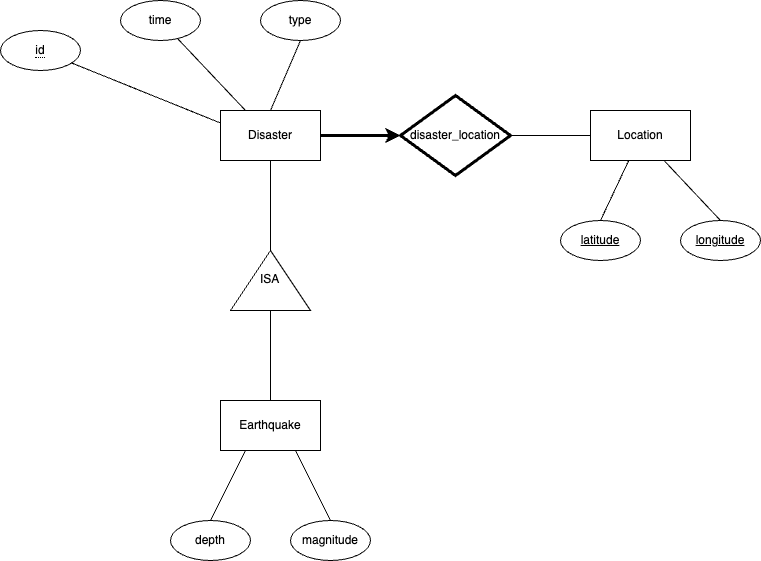

# Global Natural Disaster Tracker (GNDTracker)

A comprehensive database tracking natural disasters across North America, with potential for worldwide expansion. The system focuses on disaster types, occurrences, locations, magnitudes, and impacts.

### Team Members:

- **Team Lead**: Houssam Righi, 40155074
- Minh Huynh, 40210039
- Renaud Senécal, 40208309
- Vladimir Shterenkiker, 40158317

## Target Users

- General public seeking disaster preparedness information
- Emergency management professionals
- Policy makers and planners

Note: For scientific research purposes, please refer to specialized databases.

## Features

- Track multiple disaster types (earthquakes, floods, hurricanes, wildfires)
- Record geographical and temporal data
- Monitor human and economic impacts
- Integrate data from multiple authoritative sources

## Data Structure

### Core Entities

1. **Disasters**

   - ID, type
   - Start/end dates
   - Modified on

2. **Locations**

   - ID, country, city
   - Geographical coordinates

3. **Earthquakes**

   - Magnitude
   - Depth

## Data Sources

### 1. USGS Earthquake Catalog

- **Type**: REST API (Public)
- **URL**: https://earthquake.usgs.gov/fdsnws/event/1/
- **Content**: Earthquake and geophysical data

### 2. GDACS - Global Disaster Alert and Coordination System

- **Type**: REST API (Public)
- **URL**: https://pypi.org/project/gdacs-api/
- **Content**: Global natural disaster data


## Technical Stack

### Database

- **Primary**: PostgreSQL with PostGIS extension
- **Secondary**: Firestore for unstructured data

### Backend

- **Language**: Python
- **Libraries**:
  - `requests` for API interactions
  - `pandas` for data processing
- **ETL**: Python/Node.js pipelines

## Setup

1. Clone the repository
2. Create a `.secrets` file in the root directory
3. Install requirements

```
cd Implementation
pip install -r requirements.txt
```

## Documentation

### Phase 1

- ER Diagram: 
    

- Implementation: Class Table Inheritance pattern
- Note: Major data in disasters table; inherited tables contain disaster-specific details
  - This means joins will be required to access scientific details, however this is an acceptable performance tradeoff because of the primary use cases stated above.

### Phase 2

- ER Diagram: No changes

- Implementation: PostgreSQL data is downloaded as CSVs. The CSVs are treated and the data is uploaded to firestore.
- Location is implemented in the same table as Disaster (same as Phase 1)
- Earthquakes and Disasters are kept as separate entities, with a reference to the "parent" Disaster stored in each Earthquake document