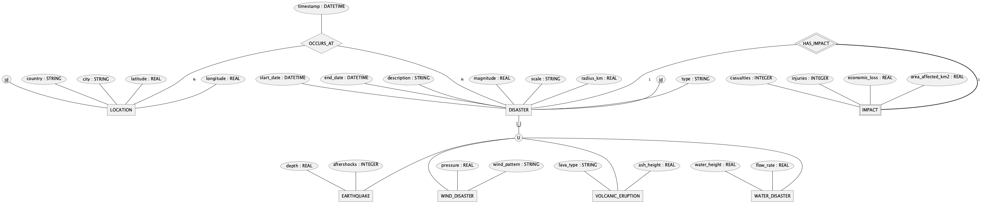

# Global Natural Disaster Tracker (GNDTracker)

A comprehensive database tracking natural disasters across North America, with potential for worldwide expansion. The system focuses on disaster types, occurrences, locations, magnitudes, and impacts.

### Team Members:

- **Team Lead**: Houssam Righi, 40155074
- Minh Huynh, 40210039
- Renaud Senécal, 40208309
- Vladimir Shterenkiker, 40158317

## Target Users

- General public seeking disaster preparedness information
- Emergency management professionals
- Policy makers and planners

Note: For scientific research purposes, please refer to specialized databases.

## Features

- Track multiple disaster types (earthquakes, floods, hurricanes, wildfires)
- Record geographical and temporal data
- Monitor human and economic impacts
- Integrate data from multiple authoritative sources

## Data Structure

### Core Entities

1. **Disasters**

   - ID, type, magnitude
   - Start/end dates
   - Description

2. **Locations**

   - ID, country, city
   - Geographical coordinates

3. **Impacts**
   - Casualties and injuries
   - Economic losses

## Data Sources

### 1. USGS Earthquake Catalog

- **Type**: REST API (Public)
- **URL**: https://earthquake.usgs.gov/fdsnws/event/1/
- **Content**: Earthquake and geophysical data

### 2. Emergency Events Database (EM-DAT)

- **Type**: REST API (Public)
- **URL**: https://data.humdata.org/faqs/devs
- **Content**: Global natural disaster data

### 3. NASA Earthdata

- **Type**: REST API (Public)
- **URL**: https://www.earthdata.nasa.gov/engage/open-data-services-and-software/api
- **Content**: Satellite and ground-based disaster data

## Technical Stack

### Database

- **Primary**: PostgreSQL with PostGIS extension
- **Secondary**: MongoDB for unstructured data

### Backend

- **Language**: Python
- **Libraries**:
  - `requests` for API interactions
  - `pandas` for data processing
- **ETL**: Python/Node.js pipelines

## Setup

1. Clone the repository
2. Create a `.secrets` file in the root directory
3. Install requirements

```
cd Implementation
pip install -r requirements.txt
```

## Documentation

### Phase 1

- [Design Documentation](https://docs.google.com/document/d/1AYF4yOZNI-FjDaTqbbB1GJdgQ2_LfGdTjHPYtuMPMVQ/edit?tab=t.0)
- ER Diagram: Created using PlantUML Chen implementation
  - Code: Documentation/chen-erd.txt
  - Reference: [PlantUML Documentation](https://plantuml.com/er-diagram)
    

### Relational Model: Available on [dbdio platform](https://dbdiagram.io/d/363-Project-67409acce9daa85aca64bf0a)

There is no local rendering for dbdio, please go on the site.

- Implementation: Class Table Inheritance pattern
- Code: [dbdio-code.txt](./Documentation/dbdio-code.txt)
- Note: Major data in disasters table; inherited tables contain scientific details
  - This means joins will be required to access scientific details, however this is an acceptable performance tradeoff because of the primary use cases stated [above](#target-users).

<iframe width="560" height="315" src='https://dbdiagram.io/e/67409acce9daa85aca64bf0a/67409d1ce9daa85aca650753'> </iframe>
